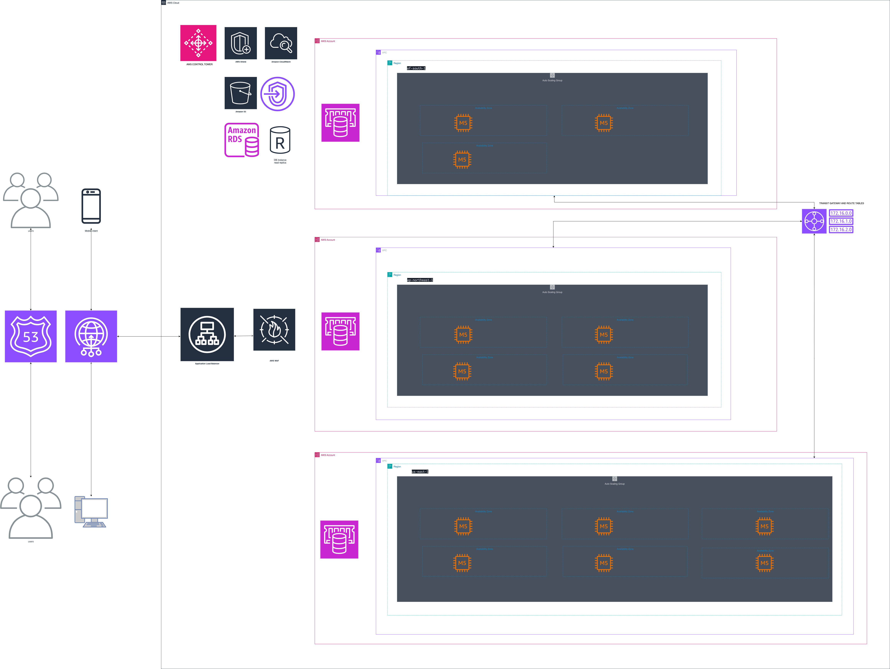

# My AWS re/Start Journey

This repo contains my personal notes, labs, and projects from the AWS re/Start program. It contains my personal notes, completed labs, and projects demonstrating applied AWS skills.

It serves as:  
- A **knowledge base** I can refer back to  
- A **portfolio** showcasing my [labs](/labs/labs-index.md), [projects](/projects/projects.md) and progress  
- Evidence of my **commitment to continuous learning** in cloud and IT

---

## Progress Tracker

- [x] Week 1 – Introduction to AWS  
- [x] Week 2 – Cloud Basics & AWS Compute Services
- [x] Week 3 – Linux & AWS Storage Services   
- [x] Week 4 – AWS Database, Storage and Analytics services
- [x] Week 5 – AWS Networking and Content Delivery services  
- [x] Week 6 – AWS Security services Part 1
- [x] Week 7 - AWS Security services Part 2
- [ ] Week 8 - Management Tools
- [ ] Week 9 - AWS Application & Migration Services
- [ ] Week 10 - AWS Developer Tools and Machine Learning
- [ ] Weeks 11,12 - Final Project & Exam Prep
- [ ] AWS Certified Cloud Practitioner – Exam PASS 🎉  

---

## Projects Showcase

### ECommerce Platform Architecture
- **Goal:** Design a scalable, secure, highly available AWS architecture for a global e-commerce web application
- **Highlights:** Multi-AZ deployment, auto-scaling, CDN caching, IAM security, cost-optimized managed services

- [View Project](projects/project-1/README.md)

---

## Topics Covered

- [Compute](/compute/topic-notes.md)
- [Storage](/storage/topic-notes.md)
- [Databases](/databases/topic-notes.md)
- [Security](/security/topic-notes.md)
- [Networking](/networking/topic-notes.md)
- [Resources](./resources/helpful-links.md)

---

## AWS Skills Builder Courses
A growing collection of courses I’ve completed on AWS Skills Builder as part of my AWS learning journey.  
  
Status | Course Name | Key Takeaway
-------|-------------|--------------
✅     | AWS Compute Services Overview | I compared EC2, Lambda, and containers for cost and scalability
✅     | Introduction to AWS Identity and Access Management (IAM) | I learned user, role, and policy management with least privilege
✅     | Introduction to Containers | I grasped Docker basics and AWS container services (ECS/EKS)
✅     | AWS Cloud Quest: Cloud Practitioner | I practiced core AWS services through gamified labs
🟡     | AWS SimuLearn: Networking Concepts | In Progress
🟡     | AWS SimuLearn: Core Security Concepts| In Progress

## Certificates  
All completed course certificates (PDFs) can be accessed here: 
- AWS Compute Services Overview [View Certificate](./certifications-and-courses/certificates/aws-compute-services-overview.pdf)

- Introduction to AWS Identity and Access Management (IAM) [View Certificate](./certifications-and-courses/certificates/introduction-to-aws-iam.pdf)
- Introduction to Containers [View Certificate](./certifications-and-courses/certificates/introduction-to-containers.pdf)
- AWS Cloud Quest: Cloud Practitioner [View Certificate](./certifications-and-courses/certificates/aws-cloud-quest-cloud-practitioner.pdf)

---

## Reflections

Through AWS re/Start, I am learning technical cloud skills as well as professional practices such as version control with GitHub, technical documentation and troubleshooting. This repo demonstrates my ability to **learn, apply and share** cloud knowledge in a structured way.  

---

## Next Steps

- Continue documenting weekly labs and notes  
- Build a small cloud project integrating multiple AWS services  
- Prepare for the **AWS Certified Cloud Practitioner** exam
- Prepare for additional AWS certifications 

---

## Resources

- [AWS Training & Certification](https://aws.amazon.com/training/)  
- [AWS Documentation](https://docs.aws.amazon.com/)  
- [AWS Well-Architected Framework](https://aws.amazon.com/architecture/well-architected/)
- [AWS Skills Builder Training](https://explore.skillbuilder.aws/)
 
